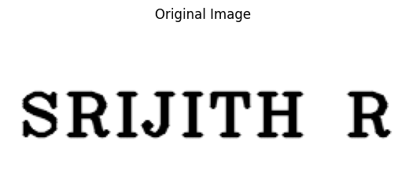
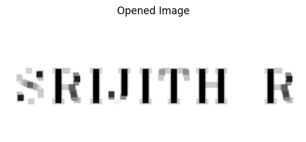
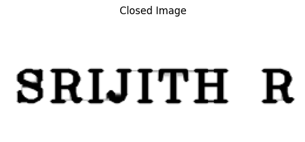

# Opening-and-Closing

## Aim
To implement Opening and Closing using Python and OpenCV.

## Software Required
1. Anaconda - Python 3.7
2. OpenCV
## Algorithm:
### Step1:
Import the necessary packages.
<br>

### Step2:
Create the Text using cv2.putText.
<br>

### Step3:
Create the sturcturing element kernel via autogeneration for opening and closing using :
```python
cv2.getStructuringElement(cv2.MORPH_RECT,('''dimention of structuring element'''))
```


### Step4:
Implement Opening and Closing over the image using cv2.morphologyEx().
<br>

### Step5:
Display the result Image.
<br>
<br>
<br>
<br>
<br>
<br>
 
## Program:
```python
# program by  : SRIJITH R
# register no : 212221240054
```
### Import the necessary packages
```python 
import cv2
import numpy as np
from matplotlib import pyplot as plt
```
### Create the Text using cv2.putText
```python
text_image = np.zeros((100,250),dtype = 'uint8')
font = cv2.FONT_HERSHEY_COMPLEX_SMALL
cv2.putText(text_image,"Kaushika",(5,70),font,2,(255),2,cv2.LINE_AA) 
plt.title("Original Image")
plt.imshow(text_image,'Blues')
plt.axis('off')
```
### Create the structuring element
```python
kernel1=cv2.getStructuringElement(cv2.MORPH_RECT,(5,5))
kernel2=cv2.getStructuringElement(cv2.MORPH_RECT,(5,5))
```
### Use Opening operation
```python
img_open=cv2.morphologyEx(text_image,cv2.MORPH_OPEN,kernel2)
plt.title("Opened Image")
plt.imshow(img_open,'Blues')
plt.axis('off')
```
# Use Closing Operation
```python
img_close=cv2.morphologyEx(text_image,cv2.MORPH_CLOSE,kernel1)
plt.title("Closed Image")
plt.imshow(img_close,'Blues')
plt.axis('off')
```


## Output:

### Input Image

<br>

### Result of Opening

<br>

### Result of Closing

<br>

## Result
Thus the Opening and Closing operation is used in the image using python and OpenCV.
